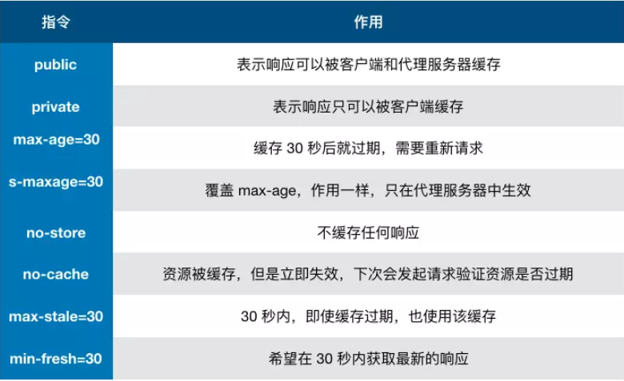

### 原始类型

-   number
-   string
-   boolean
-   undefined
-   null
-   symbol

### 原始类型与引用类型的区别

-   基础数据以栈的形式存储，用 typeof 来判断类型，存储空间固定
-   引用类型以堆的形式存储，用 instanceof 来判断类型，存储空间固定
-   原始类型存储的是值，对象类型存储的是地址(指针)
    
    

### 类型转换

-   number ==> boolean 除了 0、-0、NaN 其他都为 true
-   string ==> boolean 除了空字符串都为 true
-   undefined ==> boolean false
-   null ==> boolean false
-   引用类型 ==> boolean true
-   array ==> string [1,2] ==> '1,2'
-   object ==> string '[object, object]'
-   string ==> number '1'==> 1 , 'a'==> NaN
-   array ==> number []==>0,[1]=>>1,[1,3]=>>NaN
-   null ==> number 0
-   除了数组的引用类型 ==> number NaN
-   Symbol ==> number 抛错

### 如何正确判断 this？箭头函数的 this 是什么？

-   对于直接调用 foo 来说，不管 foo 被放在什么地方，this 一定是 window
-   对于 obj.foo()来说，谁调用了函数，谁就是 this,this 就是 obj
-   对于 new 的方式来说，this 永远被绑定了在实例上，this 不会被任何方式改变
-   箭头函数没有 this,箭头函数的 this 只取决包裹箭头函数的第一个普通函数的 this

### 改变 this 的方式有什么?

-   apply: fn.apply(this 指向(默认 window),[])
-   call : fn.apply(this 指向(默认 window),参数 1，参数 2，...)
-   bind : fn.bind(this 指向(默认 window),参数 1，参数 2，...)，返回一个新的函数
-   无论 bind 绑定几次，this 永远由第一次决定

### === 的判断流程

-   判断两者的类型是否相同，相同的话就是比大小了，类型不同的话就进行类型转换
-   判断是否在比较 null 和 undefined，是的话返回 true
-   判断两者类型是否为 string 和 number，是的话转换为 number
-   判断其中一方是否有 boolean, 先将 boolean 转为 number 再判断
-   判断其中一方是否为 object，另一方为 string、number、symbol， 先将 object 转为原始类型

### 闭包问题

-   闭包存在的意义就是让我们可以间接的访问函数内部的变量
-   防抖和节流函数中都使用到了闭包
-   如果接口请求失败，可以通过闭包的形式进行接口重发
-   可以使用闭包来实现单例模式
-   闭包会增大内存的使用，使用不当会造成内存泄漏，应在退出函数之前将局部变量置空

### 深拷贝和浅拷贝

-   可以使用 lodash 的\_cloneDeep
-   简单方式可以使用 JSON.parse(JSON.stringify(obj))
    -   会忽略 undefined
    -   会忽略 symbol
    -   不能序列化函数
    -   不能解决循环引用的对象
-   Object.assign 可以实现浅拷贝
-   展开运算符【...】也可以实现浅拷贝

### 原型与原型链

-   Object.prototype 是所有对象的爸爸，所有的对象都可以通过**proto**找到它
-   Function.prototype 是所有函数的爸爸，所有函数都可以通过**proto**找到它
-   函数的 prototype 是一个对象
-   对象的**proto**属性指向原型**proto**将对象和原型连接起来组成了原型链
    

### var(variable)、let、const(constant)的区别

-   var 会有提升概念(hoisting)
-   函数提升优先于变量提升，函数的提升会把整个函数拿到作用域顶部，便便提升只会把声明挪到作用域顶部
-   var 在全局作用域下声明的变量会挂载在 window 上，let、const 不会
-   let、const 存在暂时性死区，不能在声明前使用
-   const 用来声明常量

### 并发(concurrency) 和 并行(parallelism) 的区别

-   并发是宏观概念，在一段时间内通过任务间的切换完成了 A、B 两个任务
-   并行是微观概念，cpu 中有两个核心，可以同时完成 A、B 任务

### 进程与线程的区别

-   线程是进程中更小的单位，一个进程中可以有多个线程
-   打开一个 Tab 页就是创建一个进程，进程里有渲染线程、js 引擎线程、HTTP 请求线程
-   js 是单线程执行的，单线程节省内存，节约上下文切换时间

### 什么是执行栈？

-   执行栈是一个存储函数调用的栈结构，遵循先进后出的原则
-   栈可存放的函数是有限制的，一但存放了过多的函数而且没有得到释放就会出现爆栈的问题

### 浏览器中的 Event Loop 问题

-   首先会执行同步代码，这属于宏任务
-   当执行完所有同步代码后，执行栈为空， 查询是否有异步代码需要执行
-   执行所有的微任务
-   执行完所有的微任务之后，检查是否需要渲染页面，需要的话去渲染页面
-   然后开始下一轮的 Event Loop, 执行宏任务中的异步代码
-   微任务包括：process.nextTick, promise,
-   宏任务包括：script, setTimeout, setInterval, setImmediate, I/O, UI rending

### 垃圾回收机制

-   待补充。。。

### 什么是跨域？

-   浏览器出于安全考虑，有同源策略，如果协议、域名或者端口号有一个不同就是跨域
-   只要是用来防止 CSRF 攻击的(利用用户的登录状态发起恶意请求)
-   请求其实已经发出去了，但是浏览器拦截了响应

### 解决跨域的方法？

-   jsonp:利用 script 标签没有跨域限制的特性,通过回调函数来接收数据，只支持 get 请求
    ```
        <script src="http://domain/api?param1=a&param2=b&callback=jsonp"></script>
        <script>
            function jsonp(data) {
                console.log(data)
            }
        </script>
    ```
-   服务端设置 Access-Control-Allow-Origin CORS

### 存储的几种方式

-   

### 什么是 service work ?

-   它是运行在浏览器背后的独立线程，用来实现缓存功能
-   若想使用 service work 传输协议必须为 HTTPS
-   首先需要注册 Service Work
    ```
    if (navigator.serviceWorker) {
        navigator.serviceWorker
            .register('sw.js')
            .then(function(registration) {
                console.log('service worker 注册成功')
            })
            .catch(function(err) {
                console.log('servcie worker 注册失败')
            })
    }
    ```
-   监听到 install 事件以后就可以缓存需要存储的文件
    ```
    self.addEventListener('install', e => {
        e.waitUntil(
            caches.open('my-cache').then(function(cache) {
                return cache.addAll(['./index.html', './index.js'])
            })
        )
    })
    ```
-   下次访问通过拦截请求的方式查询是否存在缓存，存在直接读取缓存文件，否则发起请求
    ```
    self.addEventListener('fetch', e => {
        e.respondWith(
            caches.match(e.request).then(function(response) {
                if (response) {
                    return response
                }
                console.log('fetch source')
            })
        )
    })
    ```

### 浏览器的缓存机制

-   缓存位置

    -   Service Work
        -   可以自由控制缓存文件
        -   缓存是持续性的
    -   Memory Cache
        -   内存缓存读取高效
        -   持续性很短，随着进程的释放而释放
    -   Disk Cache
        -   硬盘缓存的容量大
        -   存储时效长
    -   Push Cache
        -   缓存时间短，只在会话(Session)中存在
    -   网络请求

-   缓存策略

    -   强缓存
        -   Expires
            1.  HTTP/1 的产物
            2.  表示资源会在某一时间节点后过期
            3.  受限于本地时间，可修改本地时间造成缓存失效
        -   Cache-Control
            1.  出现于 HTTP/1.1 优先级高于 Expires
                
    -   协商缓存
        -   Last-Modified
            1. 表示本地文件最后修改日期
            2. If-Modified-Since 会将 Last-Modified 值发送给服务器，询问服务器在改时间节点后资源是否有更新，有则返回最新资源，否则返回 304
        -   ETag
            1. ETag 的优先级高于 Last-Modified
            2. If-None-Match 会将当前的 ETag 发送给服务器，询问该资源的 ETag 是否有变动，有变动则将最新的资源返回

-   实际场景应用
    -   对于频繁变动的资源，首先需要使用 Cache-Control:no-cache 使浏览器每次都请求服务器，然后配合 ETag 或者 Last-Modified 来验证资源是否有效

### 安全防范知识点

-   XSS(Cross Site Scripting): 跨站脚本攻击
    -   XSS 就是攻击者想尽一切办法将可执行的代码注入到网页中
    -   将用户的输入进行转义
-   CSRF(Cross Site Request Forgery): 跨站请求伪造
    -   攻击者构造出一个后端请求地址，诱导用户点击或者自动发起请求
    -   get 方法不对数据进行修改
    -   不让第三方网站访问到用户 cookie
    -   请求附带验证信息，比如 token
