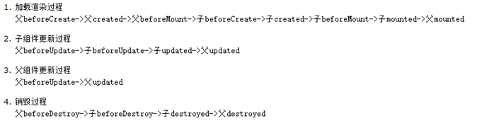

### 生命周期函数

-   在 beforeCreate 里面是获取不到 props 或者 data 里面的数据的
-   在 create 里面可以访问到 props 和 data 里面的数据，但是还未挂载，页面上看不到
-   在 beforeMount 里面开始创建 VDOM
-   在 mounted 里面 VDOM 渲染为真实 DOM 并渲染数据，如果组件中存在子组件，会递归挂载子组件，最后执行根组件的挂载钩子
-   在 beforeDestroy 里面移除事件、定时器等
-   keep-alive 有独特的生命周期，activated、deactivated
    

### 组件通信

-   父子组件通信
    -   父组件通过 props 传递数据给子组件
    -   子组件通过 emit 发送事件传递数据给父组件
-   跨多层级组件通信

    -   provide/inject

        ```
            // 父组件
            export default {
                provide: {
                    data: 'provide value'
                }
            }
            // 子组件
            export default {
                inject:['data'],
                mounted() {
                    console.log(this.data)
                }
            }

        ```

-   任意组件
    -   Vuex 或者 Event Bus

### mixin 和 mixins

-   minxin 用于全局混入，会影响到每一个组件实例
    ```
        Vue.mixin({
            beforeCreate() {
                console.log('全局混入')
            }
        })
    ```
-   mixins 混入
    -   同名的钩子函数(ex:created)将合并到一个数组，两个都将被调用，混入的钩子函数先调用
    -   值为对象的选项(ex:methods、compents、directives) 合并到一个对象，组件内的优先

### computed 和 watch 的区别

-   computed 是计算属性，依赖其他属性来计算值，而且值是有缓存的
-   watch 监听到值得变化就会执行回调，在回调中进行一些逻辑操作

### v-show 和 v-if 的区别？

-   v-show 无论初始条件是什么，都会渲染 dom 节点，只是在 display:none 与 display: block 之间切换
-   v-show 适合频繁切换的场景
-   v-if 只有在条件是 true 的时候才会渲染
-   v-if 只在必要的时候才去渲染

### 组件中的 data 什么时候可以使用对象

-   组件复用时所有的组件实例都会共享 data，如果 data 是对象的话，就会造成一个组件修改 data，会影响到其他组件
-   当我们使用 new Vue() 的方式的时候，data 可以使用对象，因为 new Vue() 生成一个根组件，该组件不会复用

### Vue 响应式原理

-   Observe 类、Dep 类、Watcher 类
-   Observe 类，利用 Object.defineProperty 方法为 data 里面的属性添加 getter 和 setter 方法，这样就可以对数据的读取进行劫持。
-   Dep 类是用于解耦属性的依赖收集和派发更新的操作，它内部实现了依赖的存储，依赖的收集方法和派发更新的方法，它还有一个全局的 target 属性
-   Watcher 类在创建实例时，将 Dep 类中的全局属性 target 指向自身，然后触发属性的 getter 添加监听，最后将 Dep.targer 置空
-   当解析到{{name}}时，就会实例化一个 watcher，从而收集到依赖，在派发更新的时候，取出对应的 watcher 然后执行 update 函数

### Object.defineProperty 的缺陷

-   通过下标的方式修改数组数据或者给对象添加新增属性的时候是不会触发组件的渲染的
-   数组的大部分操作都是拦截不到的，Vue 内部通过重写函数来解决这个问题
-   Vue.\$set(obj,key,val)
-   函数重写：先将原生的函数缓存下来，然后重写函数，调用原生函数获得结果，监听新的数据，然后手动去派发更新

