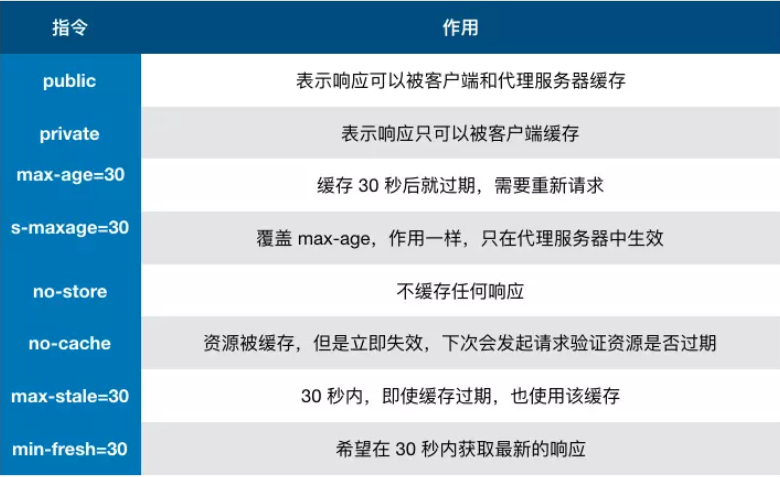

### 并发(concurrency) 和 并行(parallelism) 的区别

-   并发是宏观概念，在一段时间内通过任务间的切换完成了 A、B 两个任务
-   并行是微观概念，cpu 中有两个核心，可以同时完成 A、B 任务

### 什么是执行栈？

-   执行栈是一个存储函数调用的栈结构，遵循先进后出的原则
-   栈可存放的函数是有限制的，一但存放了过多的函数而且没有得到释放就会出现爆栈的问题

### 首屏加载优化方案

-   路由懒加载
-   使用CDN加速，将通用的库从vendor进行抽离
-   Nginx的gzip压缩
-   服务端渲染SSR
-   service worker

### CDN?

-   CDN的全称是Content Delivery Network，即内容分发网络
-   其目的是通过在现有的互联网中增加一层新的网络架构，将网站的内容发布到最接近用户的网络"边缘"，使用户可以就近取得所需的内容，解决互联网网络拥挤的状况，提高用户访问网站的响应速度。

### CDN原理

-   当终端用户（北京）向www.a.com下的指定资源发起请求时，首先向LDNS（本地DNS）发起域名解析请求。
-   LDNS检查缓存中是否有www.a.com的IP地址记录。如果有，则直接返回给终端用户；如果没有，则向授权DNS查询。
-   当授权DNS解析www.a.com时，返回域名CNAME www.a.tbcdn.com对应IP地址。
-   域名解析请求发送至阿里云DNS调度系统，并为请求分配最佳节点IP地址。
-   LDNS获取DNS返回的解析IP地址。用户获取解析IP地址。
-   用户向获取的IP地址发起对该资源的访问请求。
-   如果该IP地址对应的节点已缓存该资源，则会将数据直接返回给用户，例如，图中步骤7和8，请求结束。如果该IP地址对应的节点未缓存该资源，则节点向源站发起对该资源的请求。获取资源后，结合用户自定义配置的缓存策略，将资源缓存至节点，例如，图中的北京节点，并返回给用户，请求结束。

### 浏览器中的 Event Loop 问题

-   首先会执行同步代码，这属于宏任务
-   当执行完所有同步代码后，执行栈为空， 查询是否有异步代码需要执行
-   执行所有的微任务
-   执行完所有的微任务之后，检查是否需要渲染页面，需要的话去渲染页面
-   执行宏任务中的异步代码
-   微任务包括：process.nextTick, promise, async await
-   宏任务包括：script, setTimeout, setInterval, setImmediate, I/O, UI rending

### 垃圾回收机制

-   第一步是标记空间中活动对象和非活动对象。所谓活动对象就是还在使用的对象，非活动对象就是可以进行垃圾回收的对象。
-   第二步是回收非活动对象所占据的内存。其实就是在所有的标记完成之后，统一清理内存中所有被标记为可回收的对象。
-   第三步是做内存整理。频繁回收对象后，内存中就会存在大量不连续空间，我们把这些不连续的内存空间称为内存碎片。
-   新生代
    -   新生代中存放的是生存时间短的对象
    -   新生代中用 Scavenge 算法来处理。就是把新生代空间对半划分为两个区域，一半是对象区域，一半是空闲区域，
-   老生代
    -   老生代中存放的生存时间久的对象。
    -   老生代中是采用标记 - 清除（Mark-Sweep）的算法进行垃圾回收

### 什么是跨域？

-   为了安全，浏览器有同源策略，只要协议、域名、端口号有一个不一样就会产生跨域
-   主要是用来防止 CSRF 攻击的(利用用户的登录状态发起恶意请求)
-   请求其实已经发出去了，但是浏览器拦截了响应

### 解决跨域的方法？

-   jsonp:利用 script 标签没有跨域限制的特性,通过回调函数来接收数据，只支持 get 请求
    ```
    <script src="http://domain/api?param1=a&param2=b&callback=jsonp"></script>
    <script>
        function jsonp(data) {
            console.log(data)
        }
    </script>
    ```
-   服务端设置 Access-Control-Allow-Origin CORS
-   img 标签和 link 标签也没有跨域的限制

### 存储的几种方式


### 什么是 service work ?

-   它是运行在浏览器背后的独立线程，用来实现缓存功能
-   若想使用 service work 传输协议必须为 HTTPS
-   首先需要注册 Service Work
    ```
    if (navigator.serviceWorker) {
        navigator.serviceWorker
            .register('sw.js')
            .then(function(registration) {
                console.log('service worker 注册成功')
            })
            .catch(function(err) {
                console.log('servcie worker 注册失败')
            })
    }
    ```
-   监听到 install 事件以后就可以缓存需要存储的文件
    ```
    self.addEventListener('install', e => {
        e.waitUntil(
            caches.open('my-cache').then(function(cache) {
                return cache.addAll(['./index.html', './index.js'])
            })
        )
    })
    ```
-   下次访问通过拦截请求的方式查询是否存在缓存，存在直接读取缓存文件，否则发起请求
    ```
    self.addEventListener('fetch', e => {
        e.respondWith(
            caches.match(e.request).then(function(response) {
                if (response) {
                    return response
                }
                console.log('fetch source')
            })
        )
    })
    ```

### 浏览器的缓存机制

-   缓存位置

    -   Service Work
        -   可以自由控制缓存文件
        -   缓存是持续性的
    -   Memory Cache
        -   内存缓存读取高效
        -   持续性很短，随着进程的释放而释放
    -   Disk Cache
        -   硬盘缓存的容量大
        -   存储时效长
    -   Push Cache
        -   缓存时间短，只在会话(Session)中存在
    -   网络请求

-   缓存策略

    -   强缓存
        -   Expires
            1.  HTTP/1.0 的产物
            2.  表示资源会在某一时间节点后过期
            3.  受限于本地时间，可修改本地时间会造成缓存失效
        -   Cache-Control
            1.  出现于 HTTP/1.1 优先级高于 Expires
                
    -   协商缓存
        -   Last-Modified 
            1. 表示本地文件最后修改日期
            2. If-Modified-Since 会将 Last-Modified 值发送给服务器，询问服务器在该时间节点后资源是否有更新，有则返回最新资源，否则返回 304
        -   ETag
            1. ETag 的优先级高于 Last-Modified
            2. If-None-Match 会将当前的 ETag 发送给服务器，询问该资源的 ETag 是否有变动，有变动则将最新的资源返回

-   实际场景应用
    -   对于频繁变动的资源，首先需要使用 Cache-Control:no-cache 使浏览器每次都请求服务器，然后配合 ETag 或者 Last-Modified 来验证资源是否有效'

### 从输入 URL 到渲染出整个页面的过程包括三个部分

-   DNS 解析 URL 的过程
    -   浏览器缓存=>操作系统缓存=>路由缓存=>ISP的DNS服务器缓存=>根服务器
-   浏览器与服务器的交互过程
    -   首先浏览器利用 TCP 协议通过三次握手与服务器建立连接
    -   然后根据解析到的 IP 地址和端口号发起 http 请求
    -   服务器收到请求后，开始搜索 html 页面，找到之后返回响应
    -   成功响应，浏览器收到服务器返回的 HTML 页面开始渲染
-   浏览器页面渲染的过程
    -   浏览器会用深度遍历的方式把 HTML 的节点遍历成 DOM 树,将 CSS 解析成 CSS DOM 树
    -   然后将 DOM 树和 CSS DOM 树构造成一个 RENDER 树
    -   最后进行页面内的布局绘制

### 浏览器的渲染
-   渲染进程将 HTML 内容转换为能够读懂的 DOM 树结构。
-   渲染引擎将 CSS 样式表转化为浏览器可以理解的 styleSheets，计算出 DOM 节点的样式。
-   创建布局树，并计算元素的布局信息。对布局树进行分层，并生成分层树。
-   为每个图层生成绘制列表，并将其提交到合成线程。
-   合成线程将图层分成图块，并在光栅化线程池中将图块转换成位图。
-   合成线程发送绘制图块命令 DrawQuad 给浏览器进程。
-   浏览器进程根据 DrawQuad 消息生成页面，并显示到显示器上。

### 减少重排重绘的优化
-   使用 class 操作样式，而不是频繁操作 style
-   避免使用 table 布局
-   批量dom 操作，例如 createDocumentFragment，或者使用框架，例如 React
-   Debounce window resize 事件
-   对 dom 属性的读写要分离
-   will-change: transform 做优化


### 安全防范知识点

-   XSS(Cross Site Scripting): 跨站脚本攻击
    -   XSS 就是攻击者想尽一切办法将可执行的代码注入到网页中
    -   将用户的输入进行转义
-   CSRF(Cross Site Request Forgery): 跨站请求伪造
    -   攻击者构造出一个后端请求地址，诱导用户点击或者自动发起请求
    -   get 方法不对数据进行修改
    -   不让第三方网站访问到用户 cookie
    -   请求附带验证信息，比如 token

### session 和 cookie 的区别

-   cookie 数据是存储在浏览器上面的，每次请求都会携带，session 是存储在服务器上的
-   cookie 不是很安全，别人可以分析存放在本地的 cookie 并进行 cookie 欺骗，考虑到安全应当使用 session。
-   session 会在一定时间内保存在服务器上。当访问增多，会比较占用你服务器的性能，考虑到减轻服务器性能方面，应当使用 cookie。
-   可以考虑将登陆信息等重要信息存放为 session，其他信息如果需要保留，可以放在 cookie 中。


### 浏览器的Performance指标与性能优化


### 优化指标，提升用户体验

-   通过 Chrome DevTools 分析首屏不需要使用的 CSS 文件，以此来精简 CSS
-   内联关键的 CSS 代码
-   使用 CDN 加载资源及 dns-prefetch 预解析 DNS 的 IP 地址
-   对资源使用 preconnect，以便预先进行 IP 解析、TCP 握手、TLS 握手
-   缓存文件，对首屏数据做离线缓存
-   图片优化，包括：用 CSS 代替蹄片、裁剪适配屏幕的图片大小、小图使用 base64 或者 PNG 格式、支持 WebP 就尽量使用 WebP、渐进式加载图片